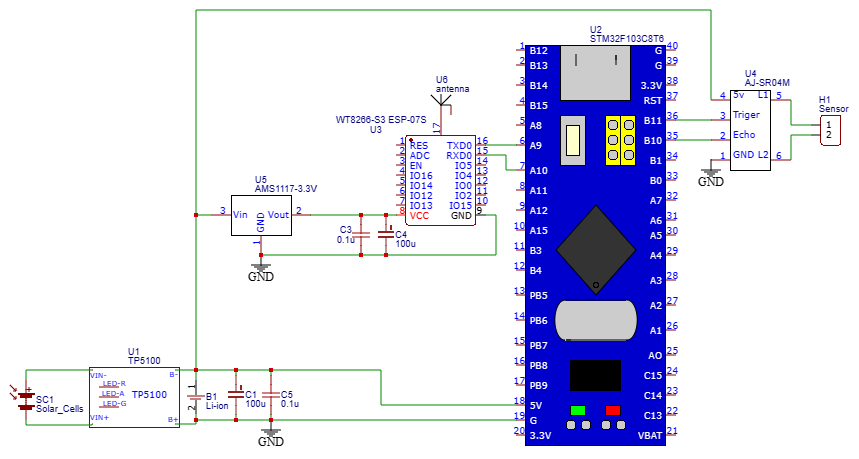

# Bluepill based device, that measure level of water in a well

Device measure levle of water in a well via ultrasonic AJ-SR04M module. Than filter data and delivery it to MQTT broker.
HomeAsstant service display level of water as a binary sensor value.

# Used modules

* BluePill STM32C8T6 microcontroller
* AJ-SR04M ultrasonic module, switched to "Serial Port triger" mode (Mode 4)
* TP4056 charge controller for charging Li-Ion acumulator and step-down voltage for acceptable for other boards 3.7-4.2V
* AMS1117 Linear Voltage Regulator for powering ESP8266 module
* ESP-07 Wi-Fi module

# Some features

* **arkhipenko/TaskScheduler** library is used for asynchronous running of metering and MQTT publishing tasks
* **robtillaart/RunningAverage** filters fake values from ultrasonic sensor
* Auto-discovery is used for automatic configuration of sensor in HomeAssistant
* Although it is ESP8266 1MB moudle, firmware with AT 2.2.0 commands is used from **CytronTechnologies/esp-at-binaries** repository

